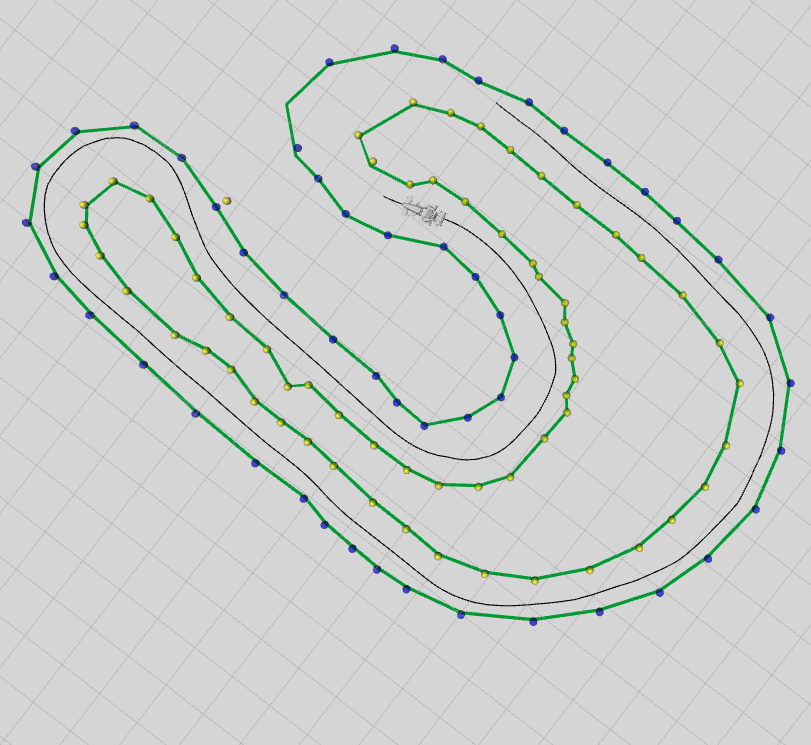

# Urimits

Urimits is a system built for the Formula Student team BCN eMotorsport that arises
from the need to detect the track limits and close the lap as earlier as possible in
order to optimize geometrically (taking into account the vehicle’s dynamic model)
the trajectory and velocity profile, this optimization can only be performed when
the whole track is delimited.

The system carries out this task by using cones that CCAT has not been able to
give a valid type yet, i.e. cones that are detected on the SLAM 3D map and not
by camera. These cones have a high probability of being a misdetection (they are
often far from the car).

Urimits’ starting point is partial track limit’s ending point.
This way, it will try to close the loop where color or shape is not stable enough for
the polynomial comparison based track limits developed by a team colleague, Oriol
Pareras.

## All-track
This track limits algorithm is all-track. This means that it either gives the limits of
the whole track or it does not output anything.

This decision is based on probability. This color blind track limits algorithm
delimits the track based on the geometry of the cone positions only. When not
perceiving all the cones of the track, a partial solution using only the track geometry
can lead to fake limits. If we can detect that the loop is closed, it has a much higher
probability of being the genuine limits.

## Greedy iterative approach
The core of this solution is an iterative process in which we start at partial track
limit’s trace final position and heading (x0, y0, θ0). Here, all the process will be
performed in R², assuming that the track is flat.

Next cones will be found geometrically. Once they are found, we assume they
are correct and we search (again) until there are no more cones to look for or the
loop is closed.

## Heuristic: angle and distance
When looking for the best next cone for a particular trace from position p0 and
having a previous position p−1, which is the cone (with position pc) that is most likely
to go next? Urimits solves this problem by finding the cone with lowest heuristic
huri. Assuming that the optimal track limits minimizes a functional that is a linear
combination between angle and distance. This functional (heuristic) combines two
sub-heuristics, distance hdist and angle hβ, through the use of a weighting factor.

## Angle-based correction
Once the first trace is computed using techniques described before, it is
very likely that the calculated trace is miscalculated, the inner
trace could have taken cones belonging to the outer trace.

When computing the outer trace, a conflict is reached given that both traces want
to take cone. To solve this problem, Urimits saves for each cone with a successor
the minimum angle it forms. In this case, the angles created by both traces at this
point, are compared. The trace with the greater angle will keep the cone.
The incorrect trace, will need to be recalculated.

Each trace will have an exclusion set E, i.e. no cone in this set can be part of
the trace.

When performing a new search, the best cone not in E will be appended
to the trace.

With this mechanism, Urimits makes sure that no trace takes other trace’s cones.

   
  Urimits closing the lap before the car reaches the finish line.

